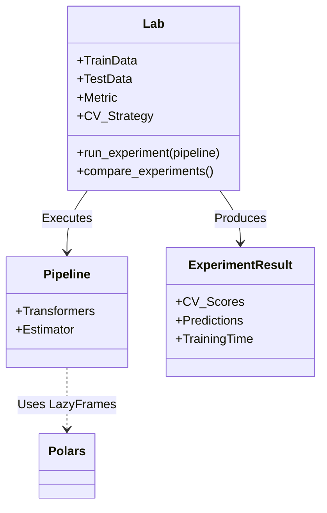

# EmpiricML


> **Science, not Alchemy.** Build reliable ML models on tabular data with the rigour of an empirical science.

EmpiricML is a Python framework designed to make building, testing, and tracking machine learning models on **tabular data** faster, easier, and most importantly, **robust**. Built on the shoulders of giants—**scikit-learn** and **Polars**—it brings the concept of a scientific "Laboratory" to your ML workflow.

---

## 🧪 The Philosophy: The Laboratory

In empirical sciences, you don't just "try things"; you design **experiments** to test hypotheses. To do that effectively, you need a controlled environment—a **Laboratory**.

**EmpiricML provides that Laboratory.**

Instead of scattered scripts and notebooks, the `Lab` class encapsulates everything required for a rigorous ML experiment:
*   **Data**: Training and testing datasets (handled efficiently via Polars).
*   **Protocol**: A defined Cross-Validation strategy.
*   **Measurement**: A specific Error or Performance Metric.
*   **Criteria**: Rules for statistical comparison to determine if Model A is *truly* better than Model B.

## ✨ Key Features

*   **⚡ Polars Integration**: Pipelines work with Polars LazyFrames for high-performance data processing.
*   **📊 Automated CV Evaluation**: Every experiment is rigorously cross-validated.
*   **⚖️ Statistical Comparison**: Don't guess. Use permutation tests and statistical thresholds to compare models.
*   **📝 Automated Tracking**: Logs results, predictions, and pipeline configurations automatically.
*   **🛑 Early Stopping**: Aborts unpromising experiments early to save compute resources.
*   **🔄 Auto Mode**: Automatically tracks and persists the best-performing experiment.
*   **🔍 Hyperparameter Optimization**: Built-in support for Grid and Random search.
*   **🧹 Feature Selection**: Permutation importance with recursive elimination.
*   **💾 Checkpointing**: Save/Restore your `Lab` state to pause and resume work seamlessly.

## 🛠️ Architecture



## 📦 Installation

```bash
pip install empml
```

## 🚀 Quick Start

### 1. Initialize your Laboratory

First, define the environment for your experiments. This ensures all models are evaluated on the exact same data and metrics.

```python
import polars as pl
from empml.metrics import MAE
from empml.data import CSVDownloader
from empml.cv import KFold
from empml.lab import Lab, EvalParams

# Create the Lab
lab = Lab(
    name = 'house_prices_lab',
    # Data Loading
    train_downloader = CSVDownloader(path='train.csv', separator=','),
    test_downloader = CSVDownloader(path='test.csv', separator=','),
    
    # Target Variable
    target = 'price',
    
    # Evaluation Protocol
    metric = MAE(),
    minimize = True,
    cv_generator = KFold(n_splits=5, random_state=42),
    
    # Comparison Rules
    eval_params = EvalParams(n_folds_threshold=1, alpha=0.05, n_iters=200)
)
```

### 2. Define a Pipeline and Run an Experiment

EmpiricML pipelines combine Feature Engineering (Transformers) and Modeling (Estimators).

```python
from lightgbm import LGBMRegressor 
from empml.pipelines import Pipeline
from empml.transformers import Log1pFeatures
from empml.wrappers import SKlearnWrapper

# Define features to use
features = ['sqft_living', 'sqft_lot', 'bedrooms', 'bathrooms']

# Create a pipeline
pipe = Pipeline(
    steps = [
        # Feature Engineering: Apply Log1p to numerical features
        ('log_scale', Log1pFeatures(features=features, new_features_suffix='')),
        # Modeling: Wrap sklearn-compatible estimators
        ('model', SKlearnWrapper(
            estimator=LGBMRegressor(verbose=-1), 
            features=features, 
            target='price'
        ))
    ], 
    name = 'LGBM_Optimized', 
    description = 'LightGBM regressor with log-transformed features.'
)

# Run the experiment in the Lab
lab.run_experiment(pipeline=pipe)
```

## 📂 Project Structure

The library is organized into logical modules found in `src/empml`:

*   `lab`: The core `Lab` class management.
*   `pipelines`: Scikit-learn style pipelines compatible with Polars.
*   `wrappers`: Wrappers for ML algorithms (XGBoost, LightGBM, CatBoost, Sklearn, Pytorch).
*   `transformers`: Feature engineering blocks.
*   `metrics`: Performance metrics.
*   `data`: Tools for handling data loading and downloads.
*   `cv`: Cross-validation splitters.

## 🤝 Contributing

Contributions are welcome! Please check out the issues or submit a PR.

1.  Fork the repository
2.  Create your feature branch (`git checkout -b feature/new-feature`)
3.  Commit your changes (`git commit -m 'Add some new feature'`)
4.  Push to the branch (`git push origin feature/new-feature`)
5.  Open a Pull Request

## 📄 Citation

If you use EmpiricML in your research, please cite:

```bibtex
@software{EmpiricML,
  title={EmpiricML: A Python framework for building robust Machine Learning models on tabular data faster and easier},
  author={Pasquale Trani},
  year={2026},
  url={https://github.com/PasqualeTrani/EmpiricML}
}
```

## 📜 License

Distributed under the MIT License. See `LICENSE` for more information.
