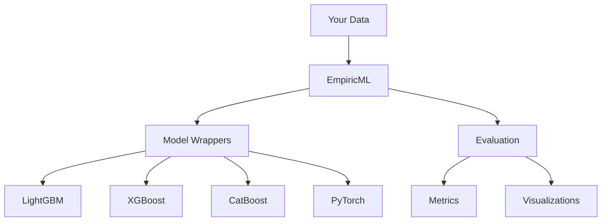

# Basic Concepts

Understanding the core concepts of EmpiricML will help you get the most out of the framework.

## Architecture Overview



## Model Wrappers

EmpiricML provides unified wrappers around popular ML libraries. Each wrapper follows a consistent API:

| Wrapper | Underlying Library | Best For |
|---------|-------------------|----------|
| `LGBMWrapper` | LightGBM | Large datasets, fast training |
| `XGBWrapper` | XGBoost | General gradient boosting |
| `CatBoostWrapper` | CatBoost | Categorical features |
| `TorchWrapper` | PyTorch | Custom neural networks |

## The Wrapper Pattern

All wrappers implement a common interface:

```python
# Common methods across all wrappers
model.fit(X, y)           # Train the model
model.predict(X)          # Make predictions
model.predict_proba(X)    # Get probability estimates
```

## Key Principles

!!! info "Consistency"
    All model wrappers share the same interface, making it easy to swap between different algorithms.

!!! info "Flexibility"
    You can customize any model by passing parameters directly to the wrapper.

!!! info "Extensibility"
    Create your own wrappers by inheriting from the base classes.

## Data Flow

1. **Input Data**: Start with pandas DataFrames or numpy arrays
2. **Preprocessing**: Apply transformations as needed
3. **Training**: Fit your chosen model
4. **Prediction**: Generate predictions on new data
5. **Evaluation**: Assess model performance with built-in metrics
